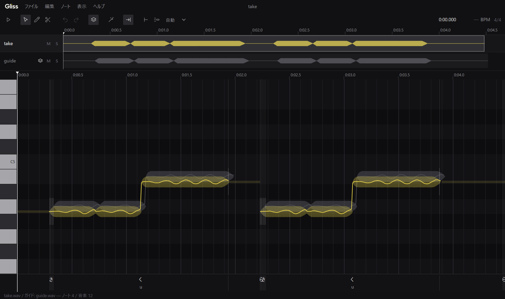

<p align="center">
  <picture>
    <source media="(prefers-color-scheme: dark)" srcset="assets/logo/gliss-wordmark.svg">
    
  </picture>
</p>

# Gliss

歌声のピッチとタイミングを直す編集ツール（Windows・日本語）。



- 録音した歌（WAV）を開くと、音程の線とノートの帯で表示する。帯を上下にドラッグでピッチ、左右で位置・長さを直す
- **ガイド**（お手本の歌）を重ねて、ずれを見ながら「ガイドに合わせる」で寄せられる（強さはスライダーで）
- 歌詞から音素を切り、**子音の長さを保ったまま**母音だけを伸び縮みさせる
- **編集していない区間は原音のまま**。書き出す WAV は元と同じ長さ・開始位置（BWF のタイムスタンプも写す）なので、DAW に戻して元の位置に置ける
- エンジンを MCP で公開していて、**Claude Code などの AI に「ずれの大きいノートを 70% ガイドに寄せて」と頼める**（画面に即反映、取り消しも共通）

ベータ版です。日本語の歌を前提にしています（歌詞・音素の処理は日本語のみ）。

- **漢字混じりの歌詞の読み**は追加の機能です。**ヘルプ > モデルと追加の機能…**（初回の「モデルの準備」の画面にも同じ行があります）から
  ダウンロードすると使えます（約 94 MB。展開後 約 320 MB）。入れなくても、かなの歌詞は使えます。
- **聞き取り**（区間の音声認識で歌詞を確かめる）は、配布版ではまだ使えません（今後、画面から入れられるようにする予定）。ソースから動かす場合は使えます。

## 必要なもの

- Windows 10 / 11（64 ビット。確かめているのは Windows 11）
- ディスク: アプリ約 700 MB ＋ 解析モデル約 760 MB（漢字の歌詞の読みを入れるとさらに約 320 MB）
- 初回にモデルをダウンロードするためのインターネット接続（約 590 MB）

## インストール

1. [Releases](https://github.com/tekalu1/gliss/releases) から `Gliss-<版>-win-x64.exe` をダウンロードする
   （同じページの `SHA256SUMS.txt` でハッシュを確かめられる）。
2. 実行する。**電子署名をまだ付けていない**ので、Windows が「Windows によって PC が保護されました」（SmartScreen）を出す。
   「**詳細情報**」→「**実行**」で進める。
3. インストール先は既定で `%LOCALAPPDATA%\Programs\Gliss`（ユーザーごと。管理者権限は要らない）。
   DAW のプラグイン（VST3 + ARA 2。開発中）もユーザーごとの VST3 の置き場 `%LOCALAPPDATA%\Programs\Common\VST3\Gliss.vst3` に入る
   （DAW がこの置き場を探さないときの手順は [docs/ara-plugin.md](docs/ara-plugin.md) の「配布」）。

新しい版が出ると、アプリが自分で見つけてダウンロードし、タイトルバーに知らせる。「再起動して更新」で入れ替わる
（ヘルプ > 更新を確認… で手動でも確かめられる。ベータ版を受け取るかは設定で選べる）。

## 初めて起動したとき

解析に使う学習済みモデル（RMVPE・HubertFA）は同梱していない。最初の画面の「**モデルの準備**」で「ダウンロード」を押すと、
公開元（GitHub）から取得し、大きさと SHA-256 を確かめてから `%LOCALAPPDATA%\Gliss\models` に置く（途中で取り消せる）。
モデルのライセンスの状況は下の表のとおりで、ダウンロードの前に画面でも確かめられる。

ピッチ（F0）の検出は、編集 > ピッチ検出の方式 で選べる: **RMVPE（既定）**・**Gliss（試作）**（Gliss が自前で学習した小さなモデル。同梱）・**Praat**（歌声向けに調整した自己相関法）。
替えると開いているトラックを解析し直し、選んだ方式は次の起動にも残る。RMVPE のモデルをまだ取得していないときは、Gliss のモデルで解析する。

## 使い方

1. **WAV をウィンドウにドラッグ＆ドロップ**（か ファイル > 開く…）。解析（音程・ノート・歌詞の推定）が走る。
2. **ガイドを重ねる**（任意）: ファイル > ガイドを開く…、か Shift を押しながらドロップ。
3. **直す**: 帯の中央を上下にドラッグでピッチ、左右で移動、端で長さ。ノートを右クリック →「ガイドに合わせる…」（G）。
   歌詞レーンをダブルクリックで歌詞を入力すると、音素の境目が出て子音を保った伸縮になる。Ctrl+Z で戻る。
4. **書き出す**: ファイル > 書き出し（Ctrl+E）。元ファイルの隣に `<名前>_ve.wav` ができる（元は書き換えない）。
5. 編集を残すなら ファイル > 保存（Ctrl+S）で `<名前>.gliss` に保存する。

複数トラック（テイク・ガイド・伴奏）、鉛筆・はさみのツール、フェード、テンポとグリッド、ショートカットの変更などの詳しい説明は
[docs/user-guide.md](docs/user-guide.md)。

### DAW の外部エディタとして使う

DAW の外部エディタに **`Gliss.exe`**（既定のインストール先は `%LOCALAPPDATA%\Programs\Gliss\Gliss.exe`）を登録する。`Gliss.exe <WAV>` で、その WAV を新しいプロジェクトのテイクとして開く（エクスプローラの「プログラムから開く」でも同じ）。

書き出した `_ve.wav` を DAW に戻し、BWF のタイムスタンプで「元の位置」に置けば揃う（Fender Studio Pro（旧 Studio One）・Reaper の手順は
[docs/user-guide.md](docs/user-guide.md) §2）。

### AI とつなぐ

**ヘルプ > AI とつなぐ…** で Claude Code・Claude Desktop に登録できる（その他のクライアントには設定の JSON をコピー）。
画面で曲を開いたまま、AI に次のように頼むと、AI が画面の曲を開いて編集し、画面に即反映される:

```
Gliss で今開いている曲の、ずれの大きいノートを一覧して、70% でガイドに寄せてから測り直して、図で見せて
```

AI に許す操作（編集・保存・書き出し）は同じダイアログで選べる。ツールの一覧と仕様は [engine/docs/MCP.md](engine/docs/MCP.md)。

## ソースから動かす

```powershell
uv venv --python 3.13 .venv
uv pip install --python .venv\Scripts\python.exe -e "engine[dev,g2p]"
cd app
pnpm install
pnpm start
```

必要なもの: Python 3.13（[uv](https://docs.astral.sh/uv/)）、Node 22 以降と pnpm 10。構成・配布版のビルド・内部の名前は
[docs/development.md](docs/development.md)。

### テスト

```powershell
cd engine; ..\.venv\Scripts\python.exe -m pytest -q    # エンジン
cd app; pnpm test:unit                                  # 画面の単体テスト（Electron を起動しない）
cd app; pnpm test                                       # 画面の通しのテスト（Electron）
```

テストに使う実際の歌声はリポジトリに入れていない。素材が要るテストは skip になり、残りは素材なしで回る。
手元の素材で全部を回す方法（環境変数 `GLISS_TEST_MATERIALS`）は [docs/testing.md](docs/testing.md)。

## 問題の報告

不具合・要望は [Issues](https://github.com/tekalu1/gliss/issues) へ。他人の歌声や権利を持っていない音声は添付しないでください。
脆弱性は公開の Issue ではなく [SECURITY.md](SECURITY.md) の方法で。

## ライセンス

Gliss は **GNU General Public License バージョン 3 以降（GPL-3.0-or-later）** で配布する。全文は [LICENSE](LICENSE)、著作権の表示は [NOTICE](NOTICE)。
既定の再合成に GPL の Praat（praat-parselmouth）を使うため GPL にしている。無保証です。

**Gliss の名前とロゴ（`assets/logo/`）は GPL の対象外**です（GPLv3 §7(e) の追加条項。[NOTICE](NOTICE)）。改変した版を配るときは、別の名前とロゴにしてください。

配布版に同梱した依存（Python・Node のパッケージ）のライセンス文は、インストール先の `resources\THIRD_PARTY_NOTICES.txt` にまとめてある。
copyleft の依存（praat-parselmouth・soxr・certifi）のソースは各 Release に添付する。

DAW のプラグイン（`Gliss.vst3`）は JUCE（AGPLv3 の側で使う）と結合しているので、**プラグインのバイナリは GNU Affero General Public License バージョン 3（AGPLv3）の条件で配る**（GPLv3 §13・AGPLv3 §13。Gliss のソースは GPL-3.0-or-later のまま）。ライセンスの文書は `Gliss.vst3\Contents\Resources` にもある。

主な依存:

| 依存 | 用途 | ライセンス |
|---|---|---|
| praat-parselmouth（Praat） | 既定の再合成（TD-PSOLA） | GPL-3.0-or-later |
| numpy / scipy / soundfile | 数値計算・WAV 入出力 | BSD-3-Clause（soundfile が使う libsndfile は LGPL-2.1） |
| librosa | 特徴量・DTW | ISC |
| soxr（python-soxr） | リサンプル | LGPL-2.1-or-later |
| matplotlib | ピアノロール PNG | PSF 系（matplotlib license） |
| onnxruntime | RMVPE・HubertFA の推論 | MIT |
| mcp（Python SDK）/ @modelcontextprotocol/sdk | MCP サーバー / クライアント | MIT |
| pyworld-prebuilt（WORLD。任意） | `world` バックエンド | MIT（WORLD 本体は Modified BSD） |
| pyopenjtalk-plus（任意） | 歌詞の漢字の読み | MIT（Open JTalk / hts_engine は Modified BSD） |
| faster-whisper（任意） / CTranslate2 | 聞き取り（区間の音声認識） | MIT / MIT（依存の PyAV は BSD-3-Clause（FFmpeg は LGPL）、tokenizers・huggingface-hub は Apache-2.0） |
| nvidia-cublas-cu12（任意） | 聞き取りを GPU で（Windows） | NVIDIA のライセンス（配布物には入れない。利用者が入れる） |
| Electron | 画面 | MIT |
| JUCE 9 | DAW のプラグイン | AGPL-3.0-only（か商用。Gliss は AGPLv3 の側で使う） |
| ARA SDK / VST3 SDK / WebView2 のローダ | DAW のプラグイン | Apache-2.0 / MIT / BSD-3-Clause |

**学習済みの重みは、Gliss の F0 モデル（下の表）以外は同梱しない。** 初回に画面から公開元のファイルを取得する（`%LOCALAPPDATA%\Gliss\models`）。重みのライセンスの状況:

| 重み | 用途 | ライセンス |
|---|---|---|
| RMVPE（[yxlllc/RMVPE](https://github.com/yxlllc/RMVPE) `230917` の `rmvpe.onnx`） | F0 推定（既定） | **記載なし**（リポジトリ・リリースにライセンス表記が無い） |
| HubertFA v0.0.7（[wolfgitpr/HubertFA](https://github.com/wolfgitpr/HubertFA) `1218_hfa_model_new_dict`） | 音素アラインメント | **未確認**（コードは Apache-2.0。重み単体の表記は確認できていない） |
| **Gliss の F0 モデル（試作）**（同梱。`gliss-f0.onnx`、135 KB） | F0 推定（RMVPE が無いとき・選んだとき） | **試作のため当面は Gliss 本体に含めて GPL-3.0-or-later で配る**（重み単体の扱いは未定）。[SwiftF0](https://github.com/lars76/swift-f0)（MIT）の学習コードの構造で、VocalSet・PTDB-TUG・CMU Arctic・LibriSpeech・NSynth・DEMAND・GuitarSet（CC BY 4.0・ODbL・CMU の許諾文。NC・SA は使っていない）だけで学習した。出典と表示は [gliss-f0.NOTICE.txt](engine/vocal_engine/analysis/models/gliss-f0.NOTICE.txt)（配布版の THIRD_PARTY_NOTICES.txt にも入る） |
| Whisper large-v3（[Systran/faster-whisper-large-v3](https://huggingface.co/Systran/faster-whisper-large-v3) `edaa852`。3.09 GB） | 聞き取り（任意） | **MIT**（[OpenAI の原版](https://huggingface.co/openai/whisper-large-v3)も MIT）。初めて「聞き取る」を使うときに確認してから `%LOCALAPPDATA%\Gliss\models\asr` へダウンロードする |

非商用（NC）の重み・データ、ライセンス不明の重みは同梱しない。
